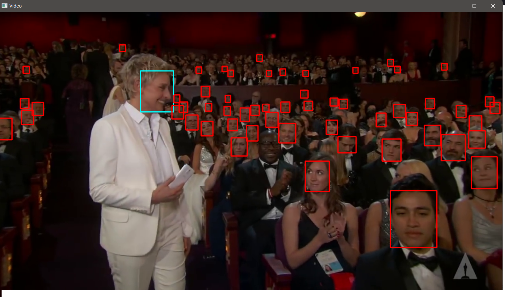

# Face-Recognizer
A facial recognition system is a technology capable of matching a human face from a digital image or a video frame against a database of faces. Such a system is typically employed to authenticate users through ID verification services and works by pinpointing and measuring facial features from a given image.


## Models
[YuNet Face Detection with DepthAI](https://github.com/geaxgx/depthai_yunet): YuNet is a light-weight, fast and accurate face detection model, which achieves 0.834(easy), 0.824(medium), 0.708(hard) on the WIDER Face validation set.

[SFace](https://github.com/zhongyy/SFace): [Article](https://ieeexplore.ieee.org/document/9318547).


## Usage 
### Install requirements
``` 
pip install -r requirements.txt
```
### load your data
You need to put the pattern face in [image folder](./src/Images/), and change the ```pattern_path``` in the code. also, you need to put a video for searching pattern in [Video folder](./src/Videos/) and change ```video_path``` in the code. (```video_path=0``` uses for webcam).

## Example
Below, you can see an example that runs on the face of 'Ellen':

- Pattern face:


- Result for one frame of video:

